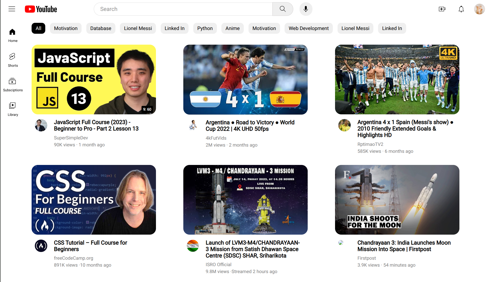

# YouTube UI Clone (CSS Focus)



<br>

A static frontend project focused on replicating the YouTube homepage layout using pure **HTML and CSS**. This project demonstrates the ability to build complex, fixed-position layouts and responsive grids.

🔗 **[Live Website](https://afsal4.github.io/YouTube/)**

## 📂 File Structure

* `index.html`: The core structure of the page.
* `/css`: Custom stylesheets containing all layout logic.
* `/icons`: SVG files for UI elements (search, menu, notifications).
* `/images`: Asset folder for thumbnails and profile pictures.

## 🚀 Local Setup

1. Clone this repository:
   ```bash
   git clone [https://github.com/afsal4/YouTube.git](https://github.com/afsal4/YouTube.git)
